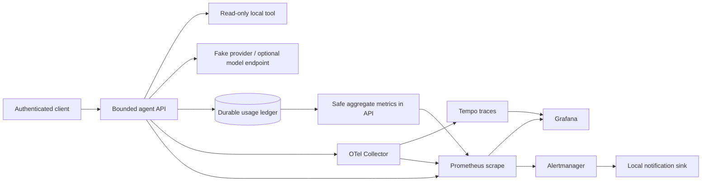

# High-level design
Status: ACCEPTED_AT_G0 (2026-09-25); reference host is macOS + Docker Desktop (arm64).

## Boundaries
API is the only application ingress; administration remains loopback/private. Collector/backend traffic stays on an internal Compose network. Authentication is checked before agent work. Provider endpoint is operator-configured and allowlisted; user input cannot select arbitrary URLs. The agent's only tool is local read-only data access. Third-party text is untrusted and cannot expand capabilities.

## Separate correctness paths
Provider attempts create durable pending usage records before dispatch. Returned usage completes the attempt. A crash or timeout after dispatch may leave charge unknown; neither traces nor retries can establish whether a provider billed it. A reconciliation view keeps uncertainty visible. Traces are diagnostic and may be dropped; metrics are operational approximations; the ledger is the source for charge summaries. All three are explicitly different.

## Deployment tradeoffs
Compose fits a single-host demonstration and makes dependencies reviewable; host failure stops everything. SQLite is adequate for the bounded one-process workload, not a promise of distributed accounting. Named volumes and verified backups support recovery. Restore and rollback are rehearsed, with backward-compatible ledger migrations mandatory.

## Optional integration
P08 can implement the provider interface without changing tracing/accounting contracts. P10 may wrap input/output boundaries, but privacy allowlisting and tool restrictions remain owned here. P11/P12 consume only sanitized evidence exports.
